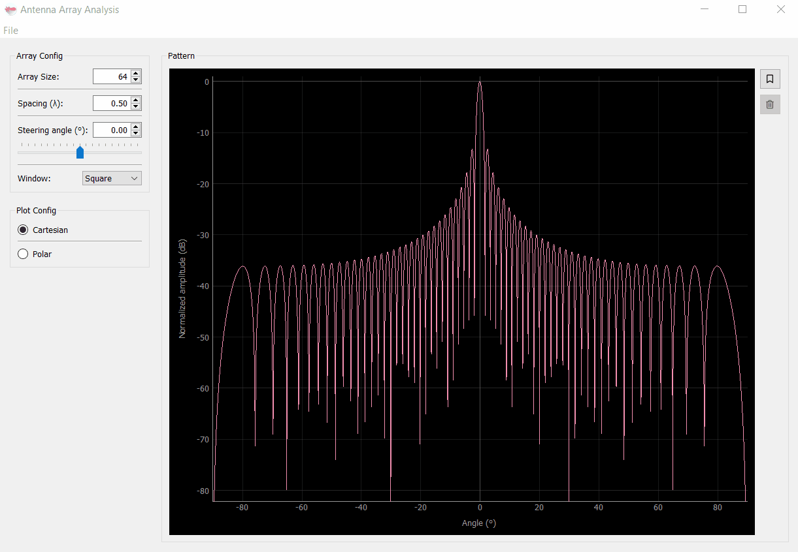

# Antenna Array Analysis

A simple GUI tool for antenna array analysis.

## Usage

- [Download](https://github.com/rookiepeng/antenna-array-analysis/releases) the corresponded release based on your system
- Run ```array_analysis```



## Feedback

Please submit bug reports and any suggestions [here](https://github.com/rookiepeng/antenna-array-analysis/issues).

