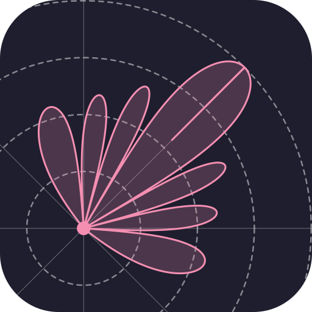
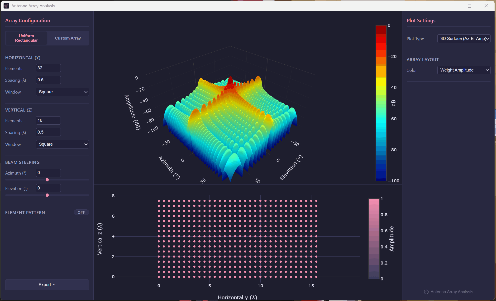

# BeamScope

BeamScope is a GUI tool for visualizing and computing antenna array beam patterns, built with Electron, TypeScript, and Plotly.js. Pattern calculations are powered by a bundled Python backend using the [`arraybeam`](https://github.com/rookiepeng/arraybeam) library (included as a git submodule under `src/arraybeam/`).





## Features

**Array modes**
- **Uniform Rectangular** — configure horizontal (y) and vertical (z) axes independently: element count (up to 1024), spacing (λ), and window function
- **Custom Array** — define arbitrary element positions (y, z in λ), amplitude, and phase per element; import from CSV

**Window functions** (per axis): Square, Chebyshev, Taylor, Hamming, Hann
- Chebyshev / Taylor expose sidelobe level (dB) and number of adjacent sidelobes controls

**Beam steering**: azimuth and elevation (−90° to +90°)

**Element pattern**: optional per-element radiation pattern defined as angle/gain (dB) tables for azimuth and/or elevation; importable from CSV

**Plot types**
- 3D Surface (Az–El–Amplitude)
- 3D Polar Pattern
- 2D Cartesian (cut plane)
- 2D Polar (cut plane, configurable minimum dB)

**Export**: array configuration and pattern data to CSV

## Prerequisites

- [Node.js](https://nodejs.org/) (v26+)
- [Python](https://www.python.org/) (v3.9+)

## Getting Started

1. Clone the repository with submodules:

   ```bash
   git clone --recurse-submodules https://github.com/rookiepeng/beamscope.git
   ```

   If you already cloned without `--recurse-submodules`, initialise the submodule with:

   ```bash
   git submodule update --init
   ```

2. Install Node.js dependencies:

   ```bash
   npm install
   ```

3. Install Python dependencies:

   ```bash
   pip install -r requirements.txt
   ```

   (`numpy`, `scipy`, and optionally `orjson` for faster JSON serialisation)

4. Build and run the app:

   ```bash
   npm start
   ```

   Or for development (build then launch):

   ```bash
   npm run dev
   ```

## Building a Distributable

The Python bridge is packaged as a self-contained executable using PyInstaller so end users do not need Python installed.

1. Build the bridge executable:

   ```bash
   python scripts/build_bridge.py
   ```

2. Package the Electron app:

   ```bash
   npm run dist
   ```

   This produces a Squirrel installer (Windows), DMG (macOS), or AppImage (Linux) under `dist/`.

## Project Structure

```
src/
  main/         # Electron main process (main.ts, pythonBridge.ts)
  renderer/     # UI — HTML, CSS, TypeScript (Plotly.js)
  python/       # bridge.py — stdin/stdout JSON bridge to arraybeam
  arraybeam/    # arraybeam submodule — Python library for array pattern computation
```

The main process spawns `src/python/bridge.py` (development) or the bundled `bridge` executable (packaged) as a persistent child process. Config is sent as a JSON line on stdin; results are returned as a JSON line on stdout.

## Development

| Command | Description |
|---|---|
| `npm run build` | Compile TypeScript only |
| `npm start` | Build + launch Electron |
| `npm run pack` | Build + package to unpacked directory |
| `npm run dist` | Build + create installer |
