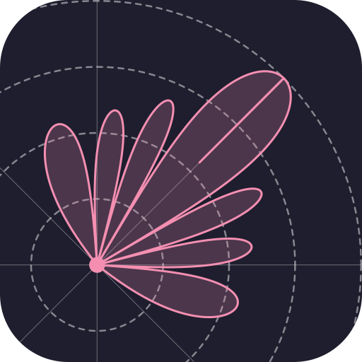

# Antenna Array Analysis

A simple GUI tool for antenna array analysis, built with Electron, TypeScript, and Plotly.js. Antenna pattern calculations are powered by the Python [antarray](https://github.com/rookiepeng/antarray) module.



## Features

- Rectangular antenna array configuration (element count, spacing, window functions)
- Beam steering (azimuth and elevation)
- Window types: Square, Chebyshev, Taylor, Hamming, Hann
- Plot types: 3D surface, 2D Cartesian, 2D Polar, Array layout
- Export array config and pattern data to CSV

## Prerequisites

- [Node.js](https://nodejs.org/) (v18+)
- [Python](https://www.python.org/) (v3.9+) with `numpy` and `scipy` installed

Install the Python dependencies:

```bash
pip install numpy scipy
```

## Getting Started

1. Install Node.js dependencies:

   ```bash
   npm install
   ```

2. Build and run the app:

   ```bash
   npm start
   ```

   Or, for development (build then launch):

   ```bash
   npm run dev
   ```

## Development

The project uses:
- **Electron** — desktop application shell
- **TypeScript** — UI and IPC logic (`src/main/`, `src/renderer/`)
- **Plotly.js** — interactive plotting
- **Python** (`src/python/bridge.py`) — calls the `antarray` module for pattern computation

To rebuild TypeScript only:

```bash
npm run build
```

## Feedback

Please submit bug reports and any suggestions [here](https://github.com/rookiepeng/antenna-array-analysis/issues).

